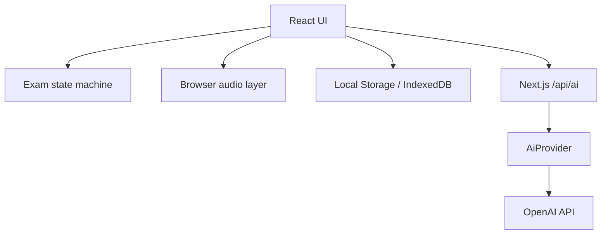
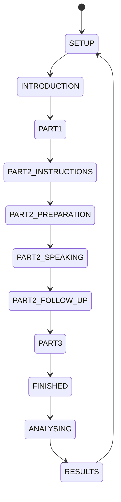

# Architecture

## 总览

Vocalis 使用 Next.js App Router。浏览器负责交互、麦克风和本地持久化；Next.js Route Handler 作为唯一的外部 AI 服务边界。

## 考试状态机

状态和合法事件由 `lib/core.mjs` 的 `transitionExam` 定义。UI 只能通过事件转场，非法转场抛出错误并由单元测试覆盖。

## 语音链路

1. `getUserMedia` 请求真实麦克风。
2. Web Audio `AnalyserNode` 计算当前音量。
3. `MediaRecorder` 生成分段 Blob。
4. Chrome Web Speech API 在可用时提供练习实时转写。
5. Mock 模式使用 Speech Synthesis 播放考官语音。
6. OpenAI 模式将分段 Blob POST 到服务端 `/api/ai` 做转写，浏览器看不到密钥。

数字人组件只接收 `idle | speaking | listening | thinking` 和音量值，因此以后可以用高级数字人 SDK 替换视觉渲染，而不改变考试状态机。

## Provider 边界

`lib/ai/providers.server.ts` 定义：

- `transcribe(audio)`
- `synthesize(text, accent, rate)`
- `evaluate(payload)`
- `health()`

新增服务时实现相同接口，并在 Route Handler 做 provider 选择。不要从浏览器直接读取密钥。

## 数据持久化

- `localStorage`: 设置、历史摘要、文字稿、最近主题和考试恢复点。
- `IndexedDB`: 仅在用户开启“保存录音”后保存音频 Blob。
- 当前页面内的 Blob URL: 默认录音回放；离开页面后失效。

服务器不保存用户音频。未来增加账户系统时，需要独立的数据保留策略、删除能力、加密与用户同意流程。

## 评分可信度

Mock 评分使用可测试的启发式指标，只用于开发预览和趋势观察。OpenAI 评分使用结构化输出，但仍是估算。两者都必须显示免责声明。没有音素级声学证据时，发音维度必须保持低置信度。
