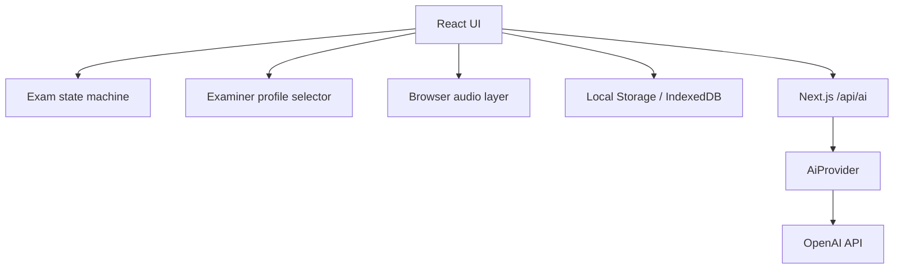
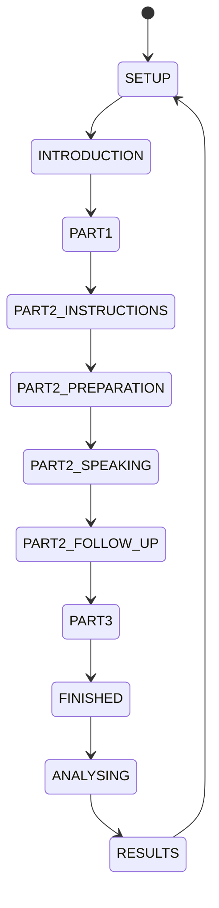

# Architecture

## 总览

Vocalis 使用 Next.js App Router。浏览器负责交互、麦克风和本地持久化；Next.js Route Handler 作为唯一的外部 AI 服务边界。

## 考试状态机

状态和合法事件由 `lib/core.mjs` 的 `transitionExam` 定义。UI 只能通过事件转场，非法转场抛出错误并由单元测试覆盖。

## 语音链路

1. `getUserMedia` 请求真实麦克风。
2. Web Audio `AnalyserNode` 计算当前音量。
3. `MediaRecorder` 生成分段 Blob。
4. Chrome Web Speech API 在可用时提供练习实时转写。
5. Mock 模式通过 `ExaminerSpeechProvider` 使用 Speech Synthesis；`lib/examiner-voices.ts` 等待 `voiceschanged`，按明确名称、地区与质量选择 voice，并提供同地区/英式回退。
6. OpenAI 模式将考官文本 POST 到 `/api/ai` 生成语音；HTMLAudioElement 连接 Web Audio `AnalyserNode`，平滑后的 RMS 只驱动考官嘴型。
7. OpenAI 模式将用户回答 Blob POST 到服务端 `/api/ai` 做转写，浏览器看不到密钥。麦克风 RMS 只显示用户音量，绝不驱动考官嘴型。

数字人组件只接收 `idle | speaking | listening | thinking`、TTS 音量、viseme 和 avatar id。当前渲染是同一 SVG 坐标系内的分层 2D rig：身体、头部、眼睑、眼球、眉毛、嘴唇与下巴分别驱动，没有静态照片上的黑色覆盖层。以后可以用 Live2D、3D blend shapes 或高级数字人 SDK 替换视觉适配器，而不改变考试状态机。

浏览器 Speech Synthesis 不暴露输出 PCM，所以本地 TTS 的嘴型使用 boundary 事件和文本元音单元生成简化 viseme；服务端 TTS 则使用真实输出振幅。这一限制在 UI 和 README 中明确说明。

## Examiner Profile

`lib/core.mjs` 定义结构化声音预设、虚构 avatar 元数据和确定性 `createExaminerProfile`：

- 全真模拟使用 `comboId` 作为 seed，只从当前 provider/设备可用的高质量声音中抽取。
- 最近三场相同口音和“avatar + voice”组合降权；没有使用无状态 `Math.random()` 直接决定考官。
- avatar 与 accent 分开选择，外观不推断口音。
- Profile 写入 checkpoint 与 history；刷新恢复时复用原 profile。
- 日常练习把 `randomEnabled` 设为 `false`，始终使用设置中保存的 `practiceVoiceId`。

## Provider 边界

`lib/ai/providers.server.ts` 定义：

- `transcribe(audio)`
- `synthesize(text, { accent, voiceId, rate })`
- `evaluate(payload)`
- `health()`

新增服务时实现相同接口，并在 Route Handler 做 provider 选择。不要从浏览器直接读取密钥。

## 数据持久化

- `localStorage`: 设置、历史摘要、文字稿、最近主题、近期考官使用记录和包含完整 examiner profile 的考试恢复点。
- `IndexedDB`: 仅在用户开启“保存录音”后保存音频 Blob。
- 当前页面内的 Blob URL: 默认录音回放；离开页面后失效。

服务器不保存用户音频。未来增加账户系统时，需要独立的数据保留策略、删除能力、加密与用户同意流程。

## 评分可信度

Mock 评分使用可测试的启发式指标，只用于开发预览和趋势观察。OpenAI 评分使用结构化输出，但仍是估算。两者都必须显示免责声明。没有音素级声学证据时，发音维度必须保持低置信度。
